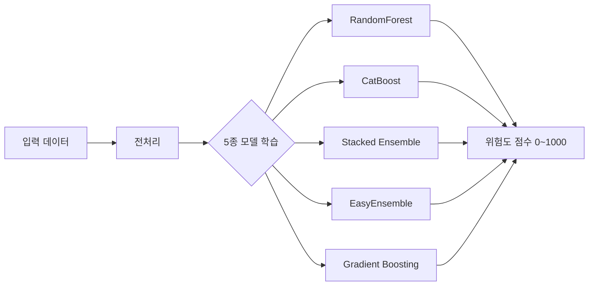
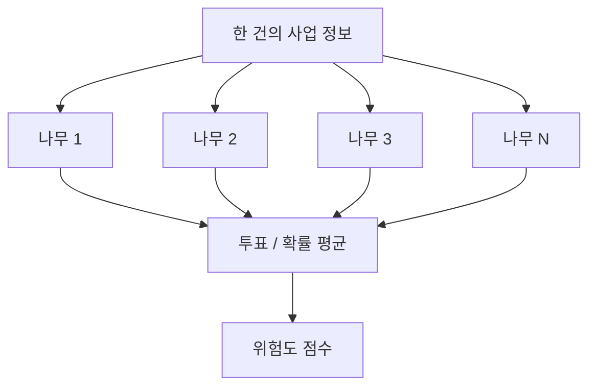
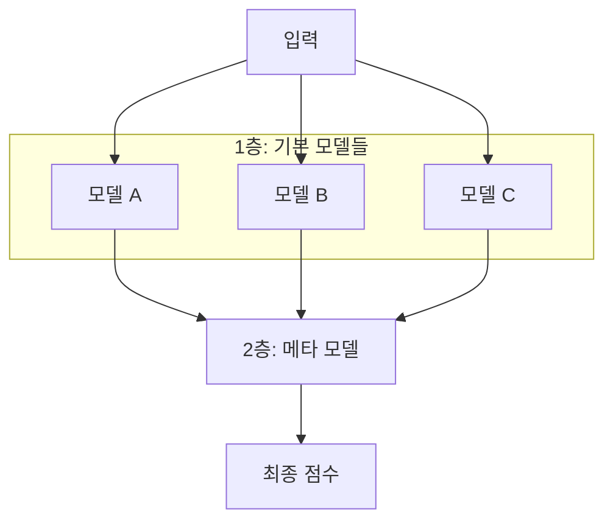
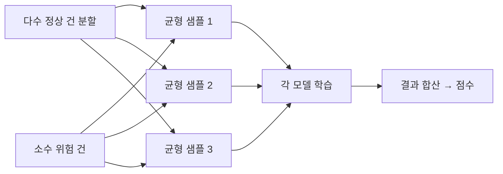
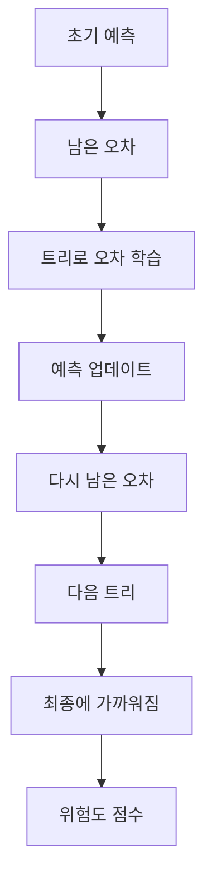

# 지방보조금 부정수급 위험도 — 지도학습

[](https://github.com/lky9464/LocalSubsidies_SupervisedLearning/releases/tag/v0.3.0)

지방보조금 부정수급 **위험도 점수(0~1000)** 측정을 위한 지도학습 파이프라인 + **로컬 웹 UI**입니다.

- **v0.3** — Next.js + FastAPI 웹 UI(`127.0.0.1:8600`), 백그라운드 Job, 운영 DB(`ops.sqlite`), 추론 결과 조회 · ([진행 중] 알고리즘 `{family}_vN` · [`VERSION_HISTORY`](docs/VERSION_HISTORY.md) Unreleased)
- **v0.2** — Streamlit UI (제거됨) · **v0.1** — CLI 전용 ([`v0.1.0`](https://github.com/lky9464/LocalSubsidies_SupervisedLearning/releases/tag/v0.1.0))
- 알고리즘: CatBoost, Stacked Ensemble, EasyEnsemble, Gradient Boosting, RandomForest
- 학습 데이터·모델·행단위 점수는 **프로젝트 폴더 밖** `{data_root}`에만 보관
- Cursor Agent는 코드/문서만 다루며, raw·학습 실행은 **사용자 로컬 Python**에서 수행

## 일반 사용자 — 오프라인 PC 설치·사용 (권장)

대상: Windows 10/11 x64 · 인터넷이 없는 업무 PC ·  
온라인에서는 **[Release v0.3.0](https://github.com/lky9464/LocalSubsidies_SupervisedLearning/releases/tag/v0.3.0) 한곳**에서 소스·wheels·UI·Python·VC++까지 받은 뒤 USB로 옮김.  
(학습·추론 raw CSV는 사용자가 별도 준비. Node.js·개발 환경 불필요.)

### A. 온라인 PC에서 받을 것 (USB에 복사)

모두 같은 [Release v0.3.0](https://github.com/lky9464/LocalSubsidies_SupervisedLearning/releases/tag/v0.3.0) Assets / Source:

| # | 파일 | 비고 |
|---|------|------|
| 1 | **Source code (zip)** | 권장 (Code 버튼 ZIP보다 태그 정합) |
| 2 | **`wheels-win-amd64-py312.zip`** | 오프라인 pip용 |
| 3 | **`web-out.zip`** | UI (**필수**) |
| 4 | **`python-3.12.10-amd64.exe`** | 공식 Python 3.12.10 x64 (이미 있으면 생략) |
| 5 | **`VC_redist.x64.exe`** | VC++ x64 (CatBoost 등 · 이미 있으면 생략) |

### B. 오프라인 PC 설치 순서 (1회)

| # | 단계 | 할 일 / 확인 |
|---|------|----------------|
| 1 | 소스 압축 해제 | 예: `C:\work\LocalSubsidies_SupervisedLearning\` — `SetupOffline.bat`, `RunWebNext.bat`이 보이면 루트 |
| 2 | wheels 배치 | `wheels-win-amd64-py312.zip`의 `.whl`을 **`vendor\wheels\`** 바로 아래 (`wheels\wheels\` 이중 폴더 금지) |
| 3 | UI 배치 | `web-out.zip` → **`web\out\`** (`web\out\index.html` 확인; zip 루트가 `index.html`이면 `web\out\`에 풀기) |
| 4 | VC++ · Python | (필요 시) `VC_redist.x64.exe` → `python-3.12.10-amd64.exe` (“Add to PATH” 권장) → `py -3.12 --version` |
| 5 | 패키지 설치 | **`SetupOffline.bat`** 더블클릭 (인터넷 불필요 · `.venv` 생성) |
| 6 | data_root | `notepad configs\local.yaml` → 예: `data_root: "C:/work/LocalSubsidies_ML_Data"` (프로젝트 **형제 폴더** 권장) |
| 7 | 폴더 골격 · raw | **`InitDataRoot.bat`** → 학습 CSV는 `{data_root}\raw\`, 추론은 `raw_inference\` ([스키마](TLS4902R_Layout.csv), 보통 EUC-KR) |
| 8 | 웹 실행 | **`RunWebNext.bat`** → **`http://127.0.0.1:8600`** (**콘솔 창을 닫지 마세요** — 서버·Job 종료) |

설치·폴더 그림·문제 해결 상세: [`docs/offline_setup.md`](docs/offline_setup.md)

### C. 일상 사용 (웹 UI)

| 순서 | 메뉴 | 할 일 |
|------|------|--------|
| 1 | Run ID 발급 | 새 Run 발급·선택 |
| 2 | 데이터 등록 | 학습 raw / 추론 raw 업로드 (메타만 DB 기록) |
| 3 | 학습 실행 | 분할·알고리즘 선택 후 파이프라인 Job 실행 (상단 배너로 진행률) |
| 4 | 모델 비교·평가 / 타겟 포착 | 순위·Test 4×4 확인 |
| 5 | 추론 실행 → 결과 확인 | 학습된 모델로 추론 · 점검 우선 4×4·Excel |

| 메뉴 | 기능 |
|------|------|
| 대시보드 | 모델 평가(순위·타겟 포착 4×4) + 추론(점검 우선 4×4) |
| 데이터 등록 | 학습 raw + 추론 raw |
| ▼ 모델 학습 및 평가 | 학습 실행 / 모델 비교·평가 / 타겟 포착 분포 |
| ▼ 추론 | 추론 실행 / 결과 확인(점검 우선순위표·Excel) |
| Run 이력 · PC 사양 · 가이드 · 설정 | Run 메타·리소스·문서·경로 |

- 더 자세한 화면 안내: [`docs/user_guide.md`](docs/user_guide.md) · PDF [`docs/user_guide.pdf`](docs/user_guide.pdf)
- 로컬 UI 원칙: [`docs/web_local.md`](docs/web_local.md)

### D. 자주 막히는 경우

| 증상 | 확인 |
|------|------|
| `SetupOffline` — wheels 없음 | Release zip을 `vendor\wheels\`에 풀었는지 |
| `SetupOffline.bat` 더블클릭 후 창이 바로 닫힘 | 최신 `SetupOffline.bat` 사용(창 유지). 또는 `cmd`에서 `SetupOffline.bat` 실행. `SetupOffline.log` 확인 |
| `InitDataRoot.bat` 경로/명령 오류·깨진 한글 | 최신 `InitDataRoot.bat` + `scripts\init_data_root.py` 사용. `configs\local.yaml`의 `data_root` 확인 후 재실행. 배치 파일은 ASCII 전용(코드페이지 무관) |
| UI 안 뜸 / 빈 화면 | `web\out\index.html` 존재 여부 (`web-out.zip`) |
| `file://` 로 HTML만 연 경우 | 반드시 `RunWebNext.bat` → `http://127.0.0.1:8600` |
| import / catboost 오류 | Python **3.12 x64**, Release의 `VC_redist.x64.exe` 설치 |
| 데이터 오류 | `configs\local.yaml`의 `data_root`, raw 위치 |

### (개발자용) 온라인 PC에서 소스만 받아 실행

인터넷·Node가 있는 PC:

1. `configs/local.yaml.example` → `configs/local.yaml` · `data_root` 설정  
2. `python -m venv .venv` → `pip install -r requirements.txt`  
3. `git pull` 로 `web/out/` 포함 여부 확인 (UI 소스만 수정한 경우 `scripts\build_web.bat` 후 커밋)  
4. `RunWebNext.bat` → `http://127.0.0.1:8600`

## 유의사항

1. **입력 데이터는 repo에 포함되지 않습니다.**  
   `TLS4902R_Layout` 스키마에 맞는 원본 CSV(EUC-KR 등)는 별도로 준비해 `{data_root}/raw`에 두어야 합니다. 이 저장소는 스키마 레이아웃(`TLS4902R_Layout.csv`)과 코드·문서만 제공합니다.

2. **실제·민감 데이터는 로컬 밖으로 나가지 않게 관리하세요.**  
   GitHub 커밋, AI Agent 프롬프트, 클라우드 동기화 등으로 raw·행단위 점수·개인식별정보가 유출되지 않도록 주의합니다. Agent/격리 규칙은 [`docs/AGENT_BOUNDARY.md`](docs/AGENT_BOUNDARY.md)를 참고하세요.

3. **학습·평가는 작업자 PC에서만 실행됩니다.**  
   머신 사양에 따라 실행 시간이 달라지며, 메모리 부족 시 전처리·학습 설정(예: 인코더, `n_jobs`, 트리 수)을 조정해야 할 수 있습니다.

4. **참고 — Repo Owner PC 주요 사양** (개발·검증에 사용한 환경)

| 항목 | 사양 |
|------|------|
| OS | Windows 11 Pro (64-bit) |
| CPU | AMD Ryzen 3 3200G (4코어 / 4스레드, 최대 3.6 GHz) |
| 메모리 | 약 14 GB RAM |
| GPU | AMD Radeon Vega 8 (내장) |
| 저장장치 | SSD/HDD C: 약 232 GB (여유 약 67 GB, 측정 시점 기준) |
| 메인보드 | MSI MS-7C51 |

## 폴더 구조

| 위치 | 내용 |
|------|------|
| 이 repo | `api/`·`web/` 웹 UI, `src/`·`scripts/`, 설정 템플릿, 스키마, 집계 리포트 |
| `{data_root}/raw`, `interim`, `processed` | **공통** 입력·통합·전처리 (1벌) |
| `{data_root}/raw_inference/` | 추론용 raw (라벨 미지, 예: 2026) |
| `{data_root}/algorithms/{algo}/` | **알고리즘별** 모델·평가·행단위 점수 (5폴더) |
| `{data_root}/algorithms/operations/` | 타겟 포착·점검 우선순위표 (`ops_queue_test.*`, `ops_queue_inference.*`) |
| `{data_root}/ops/ops.sqlite` | Run 이력·운영 큐 메타 (raw 미포함, GitHub 금지) |
| `outputs/reports/comparison/` | 5종 비교 집계 리포트 (공통) |
| `outputs/reports/{algo}/` | 알고리즘별 집계 리포트 |

```text
LocalSubsidies_ML_Data/                 # 프로젝트 밖 ({data_root})
├── raw/                                # 학습·평가 raw
├── raw_inference/                      # 추론 raw (선택)
├── interim/
├── processed/
├── ops/
│   └── ops.sqlite                      # Run·운영 큐 메타 (웹 UI)
└── algorithms/
    ├── operations/
    │   ├── ops_queue_test.xlsx         # 타겟 포착 분포 (Test)
    │   └── ops_queue_inference.xlsx    # 점검 우선순위표 (추론)
    ├── catboost_v1/
    │   ├── model.joblib
    │   ├── train_meta.json
    │   ├── eval_metrics.json
    │   └── scores/
    │       ├── test/
    │       └── inference/
    ├── stacked_ensemble_v1/
    ├── easy_ensemble_v1/
    ├── gradient_boosting_v1/
    └── random_forest_v1/

LocalSubsidies_SupervisedLearning/      # 이 repo
├── api/                                # FastAPI BFF
├── web/                                # Next.js 소스 + 정적 export(web/out, git 추적)
├── RunWebNext.bat                      # 웹 UI 실행 (더블클릭 → :8600)
└── outputs/reports/
    ├── comparison/                     # 5종 비교 Excel/PDF
    ├── catboost_v1/
    ├── stacked_ensemble_v1/
    ├── easy_ensemble_v1/
    ├── gradient_boosting_v1/
    └── random_forest_v1/
```

## 사전 준비 (사용자)

1. 외부 데이터 루트 생성 후 raw CSV(EUC-KR) 8개 배치  
   예: `...\LocalSubsidies_ML_Data\raw\`  
   (`LocalSubsidies_ML_Data` 폴더는 본 프로젝트 폴더와 **같은 위치**(형제 경로)에 두는 것을 권장)
2. 설정 복사:
   ```text
   copy configs\local.yaml.example configs\local.yaml
   ```
   `data_root`를 본인 PC 경로로 수정
3. Python 가상환경 및 패키지:
   ```text
   python -m venv .venv
   .venv\Scripts\activate
   pip install -r requirements.txt
   ```
   (`tqdm`이 있으면 진행바, 없으면 텍스트 진행률로 자동 대체됩니다.)

## CLI 실행 순서 (터미널)

웹 UI **「학습 파이프라인」** 메뉴와 동일한 단계입니다. 스크립트를 직접 실행할 때 참고하세요.

```text
python scripts/01_merge_raw.py
python scripts/02_fix_target.py
python scripts/03_preprocess.py
python scripts/04_leakage_audit.py      # 누수점검 (학습 전)
python scripts/05_train.py              # 모델 학습
python scripts/06_feature_importance.py # Feature TOP10 (evaluate 전에 필수)
python scripts/07_evaluate.py           # 평가·점수 (명칭/금액/TOP10피처값 포함)
python scripts/08_update_ranking.py     # 모델 순위 (eval 기반)
python scripts/09_report.py             # 집계 리포트
python scripts/10_ops_queue.py          # 타겟 포착 분포 Test (주/보 A~D · 4×4)
# 운영 추론 (라벨 미지 데이터, 예: 2026) — 주·보 모델 각각 (configs/default.yaml ops_queue 참고)
python scripts/11_score_inference.py --algo random_forest_v1
python scripts/11_score_inference.py --algo catboost_v1
# (선택) Validation 하이퍼 탐색 — RF/CatBoost, Test 미사용
python scripts/12_tune_hyperparams.py
```

> 의심 피처가 있으면 Feature 제외 후 `03`부터 다시 실행하고, `04` PASS 후 `05`로 진행합니다.  
> 웹 UI에서는 누수 FAIL 시 **「제외 반영 후 03부터 재개」** 로 동일하게 처리합니다.  
> 알고리즘 ID·튜닝: [`docs/algo_id_migration.md`](docs/algo_id_migration.md) · [`docs/model_tuning.md`](docs/model_tuning.md) · [`docs/hyperparam_methodology.md`](docs/hyperparam_methodology.md)

### 학습(05) — 일괄 / 개별

```text
# 5종 일괄 (알고리즘 전환 + 모델 내부 진행 표시)
python scripts/05_train.py

# 특정 알고리즘만 (--algo 반복 가능)
python scripts/05_train.py --algo catboost_v1
python scripts/05_train.py --algo random_forest_v1 --algo gradient_boosting_v1

# 알고리즘별 전용 스크립트
python scripts/05_train_catboost_v1.py
python scripts/05_train_stacked_ensemble_v1.py
python scripts/05_train_easy_ensemble_v1.py
python scripts/05_train_gradient_boosting_v1.py
python scripts/05_train_random_forest_v1.py
```

- 집계 결과: `outputs/reports/comparison/`, `outputs/reports/{algo}/`
- 행단위 점수: `{data_root}/algorithms/{algo}/scores/` (GitHub 금지)  
  - `test/{algo}_test_scores.csv` · `test/{algo}_test_scores_top.xlsx`  
  - `inference/{algo}_inference_scores.csv` · `inference/{algo}_inference_scores_top.xlsx`  
  - 컬럼: 키·명칭/금액 → 위험도점수·양성확률·예측/실제라벨 → 기여도TOP10  
  - 타겟 포착 분포(Test): `{data_root}/algorithms/operations/ops_queue_test.*` (`10`) — 웹 **타겟 포착 분포**  
  - 점검 우선순위표(추론): `{data_root}/algorithms/operations/ops_queue_inference.*` — 웹 **추론 → 결과 확인**

### Test vs 추론 (요약)

| 구분 | 데이터 | 목적 | 웹 메뉴 |
|------|--------|------|---------|
| **Test(평가)** | 라벨 있는 hold-out | 타겟 **포착 품질** (4×4 + 실제 타겟 분포) | 타겟 포착 분포 |
| **추론** | 라벨 미지 운영 데이터 | **점검 우선순위** 선정 (4×4) | 추론 → 결과 확인 |

## 타겟(TAET_YN) 규칙

기본값은 3개 플래그 중 하나라도 Y이면 양성입니다.  
업무 규칙은 [`docs/label_definition.md`](docs/label_definition.md)와 `configs/default.yaml`의 `label_rule`을 수정하세요.

## 보안 / Agent 경계

- 상세: [`docs/AGENT_BOUNDARY.md`](docs/AGENT_BOUNDARY.md)
- Cursor Rule: `.cursor/rules/no-sensitive-data.mdc`
- `LocalSubsidies_ML_Data`를 Cursor 워크스페이스에 **추가하지 마세요**
- 프롬프트에 **폴더 경로**만 언급하는 것은 가능, raw 파일 내용 요청은 금지

## 문서

| 문서 | 내용 |
|------|------|
| [`docs/user_guide.md`](docs/user_guide.md) | 웹 UI 사용법 (PDF: [`user_guide.pdf`](docs/user_guide.pdf)) |
| [`docs/web_local.md`](docs/web_local.md) | Next+FastAPI 로컬 UI 실행·보안 원칙 |
| [`docs/project_introduction.md`](docs/project_introduction.md) | 프로젝트 소개 (PDF/PPT 동봉) |
| [`docs/pipeline.md`](docs/pipeline.md) | 스크립트 순서, 점수 파일명·컬럼, GitHub 허용/금지 |
| [`docs/operations_criteria.md`](docs/operations_criteria.md) | 주·보 선정 원칙·4×4·평가 스냅샷 |
| [`docs/metrics_guide.md`](docs/metrics_guide.md) | 평가 지표 해설 |
| [`docs/offline_setup.md`](docs/offline_setup.md) | **오프라인 사용법** (GitHub 다운로드 → 설치 → 실행) |
| [`docs/model_tuning.md`](docs/model_tuning.md) | 하이퍼파라미터 튜닝·기준선·피처 다음 단계 |
| [`docs/hyperparam_methodology.md`](docs/hyperparam_methodology.md) | 5종 하이퍼 수정 **방법론** (수치 미적용) |
| [`docs/algo_id_migration.md`](docs/algo_id_migration.md) | algo_id `*_v1` 로컬 마이그레이션 |
| [`docs/VERSION_HISTORY.md`](docs/VERSION_HISTORY.md) | 버전 이력 (v0.1~) |
| [`docs/AGENT_BOUNDARY.md`](docs/AGENT_BOUNDARY.md) | Cursor Agent / 민감데이터 격리 |

---

## 참고. 사용 알고리즘 5종 설명

아래는 비전문가도 흐름을 잡을 수 있도록 **직관 설명 + 도식**으로 정리한 것입니다.

**주·보 모델:** 5종을 학습·비교한 뒤 **평가(07)·순위(08)** 와 `configs/default.yaml`의 `ops_queue.primary_algo` / `aux_algo`로 정합니다.  
데이터·타겟 정의·재학습에 따라 **주·보에 쓰는 알고리즘은 바뀔 수 있습니다** (고정 아님).  
현재 평가 스냅샷·선정 기준: [`docs/operations_criteria.md`](docs/operations_criteria.md)



### 1. RandomForest (랜덤 포레스트)

**한 줄:** 서로 다른 “작은 결정나무”를 많이 키운 뒤, **다수결(또는 평균)** 로 최종 판단을 냅니다.

- 나무가 하나만 있으면 편향·과적합에 약할 수 있지만, 여러 나무를 **투표**하면 흔들림이 줄어듭니다.
- 불균형·범주형이 많은 업무 데이터에서 **안정적인 baseline**으로 자주 1~2위에 오며, 주·보 후보로 자주 쓰입니다.



### 2. CatBoost

**한 줄:** 틀린 부분을 다음 단계에서 **순서대로 보정해 가는** 부스팅 계열 모델입니다. 범주형(코드·구분값) 처리에 강점이 있습니다.

- “한 번에 완벽”이 아니라, **약한 학습기를 쌓아 오차를 줄여** 갑니다.
- 범주형(코드·구분값) 처리에 강해 **주·보 중 하나 또는 교차 확인용** 후보로 자주 쓰입니다.


### 3. Stacked Ensemble (스택드 앙상블)

**한 줄:** 여러 모델의 예측을 모은 뒤, **상위(메타) 모델이 한 번 더 종합**하는 구조입니다.

- 1층: 여러 기본 모델이 각자 점수/확률을 냄  
- 2층: 그 결과들을 입력으로 받아 최종 판단을 냄  
- **참고·비교용**으로 학습하며, 평가 순위에 따라 주·보 후보가 될 수 있습니다.



### 4. EasyEnsemble

**한 줄:** 위험(양성) 건이 **매우 적을 때**, 정상 건을 여러 묶음으로 나눠 **균형 잡힌 작은 문제**를 여러 번 풀고 합칩니다.

- 부정수급처럼 “드문 사건”에서, 한쪽만 많은 데이터 편향을 완화하려는 접근입니다.
- 일부 평가에서는 성능이 상대적으로 낮을 수 있어 **비교·리포트용**으로 두고, 순위는 08·07 결과를 따릅니다.



### 5. Gradient Boosting (그래디언트 부스팅)

**한 줄:** CatBoost와 같은 **“틀린 곳을 단계적으로 고치는”** 계열이지만, 구현·하이퍼파라미터 체계가 다른 고전적 부스팅입니다.

- 잔차(남은 오차)를 다음 트리가 학습하는 방식으로 성능을 올립니다.
- 5종 비교에 포함하며, **평가 순위**에 따라 주·보·참고 역할이 정해집니다.


