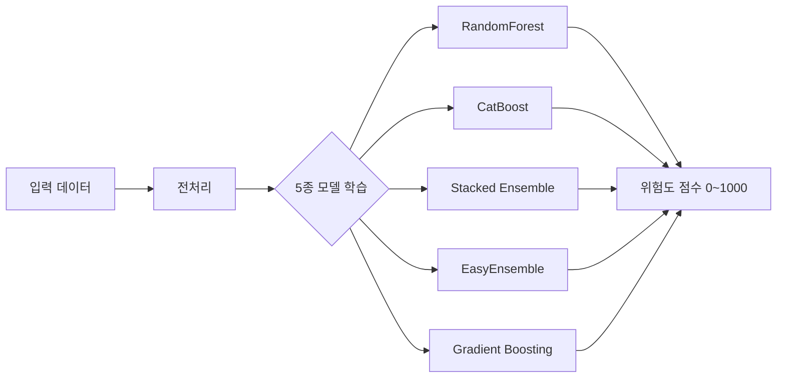
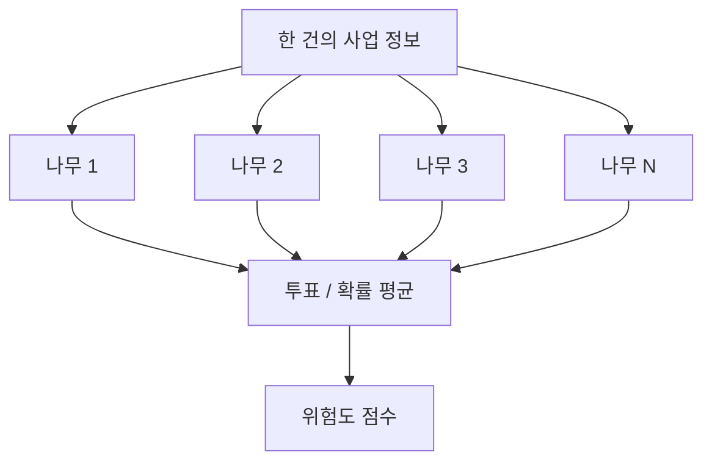
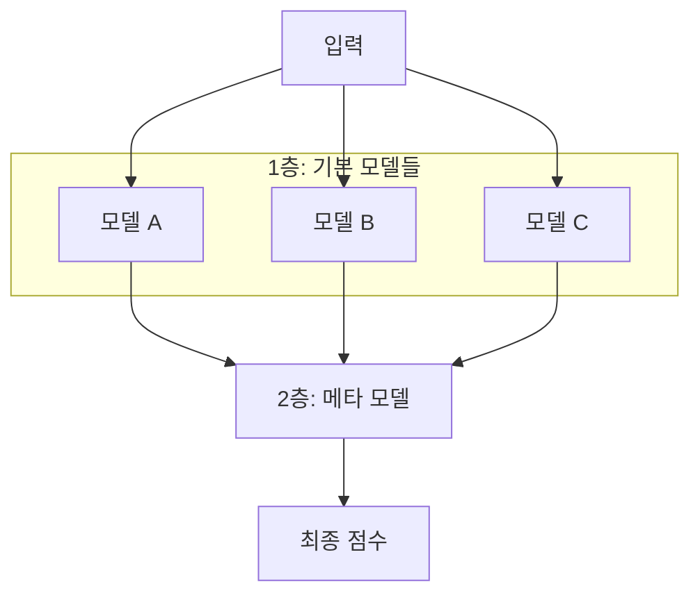
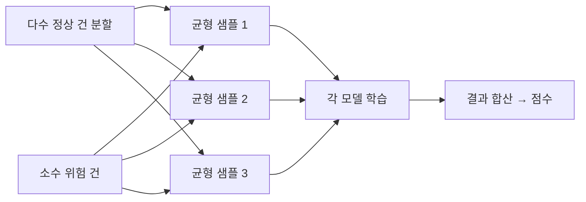
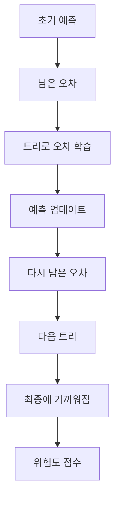

# 지방보조금 부정수급 위험도 — 지도학습

[](https://github.com/lky9464/LocalSubsidies_SupervisedLearning/releases/tag/v0.2.0)

지방보조금 부정수급 **위험도 점수(0~1000)** 측정을 위한 지도학습 파이프라인 + **로컬 웹 UI**입니다.

- **v0.2** — Streamlit 웹 UI(`127.0.0.1`), 백그라운드 Job, 운영 DB(`ops.sqlite`), 추론 결과 조회
- **v0.1** — CLI 전용 파이프라인 ([`v0.1.0`](https://github.com/lky9464/LocalSubsidies_SupervisedLearning/releases/tag/v0.1.0))
- 알고리즘: CatBoost, Stacked Ensemble, EasyEnsemble, Gradient Boosting, RandomForest
- 학습 데이터·모델·행단위 점수는 **프로젝트 폴더 밖** `{data_root}`에만 보관
- Cursor Agent는 코드/문서만 다루며, raw·학습 실행은 **사용자 로컬 Python**에서 수행

## 빠른 시작 (웹 UI — 권장)

1. [`configs/local.yaml.example`](configs/local.yaml.example) → `configs/local.yaml` 복사 후 `data_root` 설정
2. 가상환경 + `pip install -r requirements.txt`
3. **`RunWeb.bat`** 더블클릭 (또는 `.\scripts\run_web.ps1`) → 브라우저 `http://127.0.0.1:8501`

| 메뉴 | 기능 |
|------|------|
| 대시보드 | 모델 평가(순위·타겟 포착 4×4) + 추론(점검 우선 4×4) |
| 데이터 등록 | 학습 raw + 추론 raw |
| ▼ 모델 학습 및 평가 | 학습 파이프라인 / 모델 비교·평가 / 타겟 포착 분포 |
| ▼ 추론 | 추론 실행 / 결과 확인(점검 우선순위표·Excel) |
| Run 이력 · PC 사양 · 가이드 · 설정 | Run 메타·리소스·문서·경로 |

- 파이프라인은 **백그라운드 Job**으로 실행 — 메뉴를 바꿔도 계속 진행, 상단 배너에서 진행률 확인
- 상세: [`docs/web_local.md`](docs/web_local.md) · [`docs/user_guide.md`](docs/user_guide.md) · PDF [`docs/user_guide.pdf`](docs/user_guide.pdf)
- 소개 자료: [`docs/project_introduction.md`](docs/project_introduction.md) 

## 오프라인 사용법

인터넷이 없는 PC에서는 소스 ZIP만으로 `pip install`이 되지 않습니다.  
**소스 + Release wheel 묶음**을 USB로 옮긴 뒤 설치합니다.

### GitHub에서 받을 것 (온라인 PC)

| # | 받을 것 | 위치 |
|---|---------|------|
| 1 | 소스 ZIP | 초록 **Code** → **Download ZIP** |
| 2 | 패키지 묶음 | [Releases → v0.2.0](https://github.com/lky9464/LocalSubsidies_SupervisedLearning/releases/tag/v0.2.0) → **`wheels-win-amd64-py312.zip`** |
| 3 | (필요 시) | Python **3.12 x64** 설치 파일 ([python.org](https://www.python.org/downloads/windows/)) |

raw CSV는 GitHub에 없습니다. 학습·추론 데이터는 사용자가 별도로 준비합니다.

### 오프라인 PC 순서

1. 소스 ZIP 압축 해제  
2. `wheels-win-amd64-py312.zip`을 풀어 **`vendor\wheels\*.whl`** 이 되게 함  
3. Python 3.12 x64 설치 (“Add to PATH” 권장)  
4. **`SetupOffline.bat`** 더블클릭 (1회)  
5. `notepad configs\local.yaml` → `data_root` 경로 수정  
6. **`InitDataRoot.bat`** → raw를 `{data_root}\raw\` (추론은 `raw_inference\`)에 배치  
7. **`RunWeb.bat`** → 브라우저 `http://127.0.0.1:8501` (콘솔 창 유지)

**전체 단계·폴더 구조·문제 해결:** [`docs/offline_setup.md`](docs/offline_setup.md)  
(화면 안내·USB 체크리스트·wheel 재배포 방법 포함)

## 유의사항

1. **입력 데이터는 repo에 포함되지 않습니다.**  
   `TLS4902R_Layout` 스키마에 맞는 원본 CSV(EUC-KR 등)는 별도로 준비해 `{data_root}/raw`에 두어야 합니다. 이 저장소는 스키마 레이아웃(`TLS4902R_Layout.csv`)과 코드·문서만 제공합니다.

2. **실제·민감 데이터는 로컬 밖으로 나가지 않게 관리하세요.**  
   GitHub 커밋, AI Agent 프롬프트, 클라우드 동기화 등으로 raw·행단위 점수·개인식별정보가 유출되지 않도록 주의합니다. Agent/격리 규칙은 [`docs/AGENT_BOUNDARY.md`](docs/AGENT_BOUNDARY.md)를 참고하세요.

3. **학습·평가는 작업자 PC에서만 실행됩니다.**  
   머신 사양에 따라 실행 시간이 달라지며, 메모리 부족 시 전처리·학습 설정(예: 인코더, `n_jobs`, 트리 수)을 조정해야 할 수 있습니다.

4. **참고 — Repo Owner PC 주요 사양** (개발·검증에 사용한 환경)

| 항목 | 사양 |
|------|------|
| OS | Windows 11 Pro (64-bit) |
| CPU | AMD Ryzen 3 3200G (4코어 / 4스레드, 최대 3.6 GHz) |
| 메모리 | 약 14 GB RAM |
| GPU | AMD Radeon Vega 8 (내장) |
| 저장장치 | SSD/HDD C: 약 232 GB (여유 약 67 GB, 측정 시점 기준) |
| 메인보드 | MSI MS-7C51 |

## 폴더 구조

| 위치 | 내용 |
|------|------|
| 이 repo | `app/` 웹 UI, `src/`·`scripts/`, 설정 템플릿, 스키마, 집계 리포트 |
| `{data_root}/raw`, `interim`, `processed` | **공통** 입력·통합·전처리 (1벌) |
| `{data_root}/raw_inference/` | 추론용 raw (라벨 미지, 예: 2026) |
| `{data_root}/algorithms/{algo}/` | **알고리즘별** 모델·평가·행단위 점수 (5폴더) |
| `{data_root}/algorithms/operations/` | 타겟 포착·점검 우선순위표 (`ops_queue_test.*`, `ops_queue_inference.*`) |
| `{data_root}/ops/ops.sqlite` | Run 이력·운영 큐 메타 (raw 미포함, GitHub 금지) |
| `outputs/reports/comparison/` | 5종 비교 집계 리포트 (공통) |
| `outputs/reports/{algo}/` | 알고리즘별 집계 리포트 |

```text
LocalSubsidies_ML_Data/                 # 프로젝트 밖 ({data_root})
├── raw/                                # 학습·평가 raw
├── raw_inference/                      # 추론 raw (선택)
├── interim/
├── processed/
├── ops/
│   └── ops.sqlite                      # Run·운영 큐 메타 (웹 UI)
└── algorithms/
    ├── operations/
    │   ├── ops_queue_test.xlsx         # 타겟 포착 분포 (Test)
    │   └── ops_queue_inference.xlsx    # 점검 우선순위표 (추론)
    ├── catboost/
    │   ├── model.joblib
    │   ├── train_meta.json
    │   ├── eval_metrics.json
    │   └── scores/
    │       ├── test/                   # {algo}_test_scores.csv 등
    │       └── inference/              # {algo}_inference_scores.csv 등
    ├── stacked_ensemble/
    ├── easy_ensemble/
    ├── gradient_boosting/
    └── random_forest/

LocalSubsidies_SupervisedLearning/      # 이 repo
├── app/                                # Streamlit 웹 UI (v0.2)
├── RunWeb.bat                          # 웹 UI 실행 (더블클릭)
└── outputs/reports/
    ├── comparison/                     # 5종 비교 Excel/PDF
    ├── catboost/
    ├── stacked_ensemble/
    ├── easy_ensemble/
    ├── gradient_boosting/
    └── random_forest/
```

## 사전 준비 (사용자)

1. 외부 데이터 루트 생성 후 raw CSV(EUC-KR) 8개 배치  
   예: `...\LocalSubsidies_ML_Data\raw\`  
   (`LocalSubsidies_ML_Data` 폴더는 본 프로젝트 폴더와 **같은 위치**(형제 경로)에 두는 것을 권장)
2. 설정 복사:
   ```text
   copy configs\local.yaml.example configs\local.yaml
   ```
   `data_root`를 본인 PC 경로로 수정
3. Python 가상환경 및 패키지:
   ```text
   python -m venv .venv
   .venv\Scripts\activate
   pip install -r requirements.txt
   ```
   (`tqdm`이 있으면 진행바, 없으면 텍스트 진행률로 자동 대체됩니다.)

## CLI 실행 순서 (터미널)

웹 UI **「학습 파이프라인」** 메뉴와 동일한 단계입니다. 스크립트를 직접 실행할 때 참고하세요.

```text
python scripts/01_merge_raw.py
python scripts/02_fix_target.py
python scripts/03_preprocess.py
python scripts/04_leakage_audit.py      # 누수점검 (학습 전)
python scripts/05_train.py              # 모델 학습
python scripts/06_feature_importance.py # Feature TOP10 (evaluate 전에 필수)
python scripts/07_evaluate.py           # 평가·점수 (명칭/금액/TOP10피처값 포함)
python scripts/08_update_ranking.py     # 모델 순위 (eval 기반)
python scripts/09_report.py             # 집계 리포트
python scripts/10_ops_queue.py          # 타겟 포착 분포 Test (주/보 A~D · 4×4)
# 운영 추론 (라벨 미지 데이터, 예: 2026)
python scripts/11_score_inference.py --algo random_forest
```

> 의심 피처가 있으면 Feature 제외 후 `03`부터 다시 실행하고, `04` PASS 후 `05`로 진행합니다.  
> 웹 UI에서는 누수 FAIL 시 **「제외 반영 후 03부터 재개」** 로 동일하게 처리합니다.

### 학습(05) — 일괄 / 개별

```text
# 5종 일괄 (알고리즘 전환 + 모델 내부 진행 표시)
python scripts/05_train.py

# 특정 알고리즘만 (--algo 반복 가능)
python scripts/05_train.py --algo catboost
python scripts/05_train.py --algo random_forest --algo gradient_boosting

# 알고리즘별 전용 스크립트
python scripts/05_train_catboost.py
python scripts/05_train_stacked_ensemble.py
python scripts/05_train_easy_ensemble.py
python scripts/05_train_gradient_boosting.py
python scripts/05_train_random_forest.py
```

- 집계 결과: `outputs/reports/comparison/`, `outputs/reports/{algo}/`
- 행단위 점수: `{data_root}/algorithms/{algo}/scores/` (GitHub 금지)  
  - `test/{algo}_test_scores.csv` · `test/{algo}_test_scores_top.xlsx`  
  - `inference/{algo}_inference_scores.csv` · `inference/{algo}_inference_scores_top.xlsx`  
  - 컬럼: 키·명칭/금액 → 위험도점수·양성확률·예측/실제라벨 → 기여도TOP10  
  - 타겟 포착 분포(Test): `{data_root}/algorithms/operations/ops_queue_test.*` (`10`) — 웹 **타겟 포착 분포**  
  - 점검 우선순위표(추론): `{data_root}/algorithms/operations/ops_queue_inference.*` — 웹 **추론 → 결과 확인**

### Test vs 추론 (요약)

| 구분 | 데이터 | 목적 | 웹 메뉴 |
|------|--------|------|---------|
| **Test(평가)** | 라벨 있는 hold-out | 타겟 **포착 품질** (4×4 + 실제 타겟 분포) | 타겟 포착 분포 |
| **추론** | 라벨 미지 운영 데이터 | **점검 우선순위** 선정 (4×4) | 추론 → 결과 확인 |

## 타겟(TAET_YN) 규칙

기본값은 3개 플래그 중 하나라도 Y이면 양성입니다.  
업무 규칙은 [`docs/label_definition.md`](docs/label_definition.md)와 `configs/default.yaml`의 `label_rule`을 수정하세요.

## 보안 / Agent 경계

- 상세: [`docs/AGENT_BOUNDARY.md`](docs/AGENT_BOUNDARY.md)
- Cursor Rule: `.cursor/rules/no-sensitive-data.mdc`
- `LocalSubsidies_ML_Data`를 Cursor 워크스페이스에 **추가하지 마세요**
- 프롬프트에 **폴더 경로**만 언급하는 것은 가능, raw 파일 내용 요청은 금지

## 문서

| 문서 | 내용 |
|------|------|
| [`docs/user_guide.md`](docs/user_guide.md) | 웹 UI 사용법 (PDF: [`user_guide.pdf`](docs/user_guide.pdf)) |
| [`docs/web_local.md`](docs/web_local.md) | Streamlit 실행·보안 원칙 |
| [`docs/project_introduction.md`](docs/project_introduction.md) | 프로젝트 소개 (PDF/PPT 동봉) |
| [`docs/pipeline.md`](docs/pipeline.md) | 스크립트 순서, 점수 파일명·컬럼, GitHub 허용/금지 |
| [`docs/operations_criteria.md`](docs/operations_criteria.md) | 모델 순위·타겟 포착·점검 우선순위 (4×4) |
| [`docs/metrics_guide.md`](docs/metrics_guide.md) | 평가 지표 해설 |
| [`docs/offline_setup.md`](docs/offline_setup.md) | **오프라인 사용법** (GitHub 다운로드 → 설치 → 실행) |
| [`docs/AGENT_BOUNDARY.md`](docs/AGENT_BOUNDARY.md) | Cursor Agent / 민감데이터 격리 |

---

## 참고. 사용 알고리즘 5종 설명

아래는 비전문가도 흐름을 잡을 수 있도록 **직관 설명 + 도식**으로 정리한 것입니다.  
(운영 순위·수치 비교는 [`docs/operations_criteria.md`](docs/operations_criteria.md) 참고)



### 1. RandomForest (랜덤 포레스트)

**한 줄:** 서로 다른 “작은 결정나무”를 많이 키운 뒤, **다수결(또는 평균)** 로 최종 판단을 냅니다.

- 나무가 하나만 있으면 편향·과적합에 약할 수 있지만, 여러 나무를 **투표**하면 흔들림이 줄어듭니다.
- 본 프로젝트에서는 **주 운영 모델**로 사용합니다.



### 2. CatBoost

**한 줄:** 틀린 부분을 다음 단계에서 **순서대로 보정해 가는** 부스팅 계열 모델입니다. 범주형(코드·구분값) 처리에 강점이 있습니다.

- “한 번에 완벽”이 아니라, **약한 학습기를 쌓아 오차를 줄여** 갑니다.
- 본 프로젝트에서는 **보조·교차확인 모델**로 사용합니다.


### 3. Stacked Ensemble (스택드 앙상블)

**한 줄:** 여러 모델의 예측을 모은 뒤, **상위(메타) 모델이 한 번 더 종합**하는 구조입니다.

- 1층: 여러 기본 모델이 각자 점수/확률을 냄  
- 2층: 그 결과들을 입력으로 받아 최종 판단을 냄  
- 본 프로젝트에서는 **참고·예비 모델**로 둡니다 (단독 운영보다 비교용에 가깝습니다).



### 4. EasyEnsemble

**한 줄:** 위험(양성) 건이 **매우 적을 때**, 정상 건을 여러 묶음으로 나눠 **균형 잡힌 작은 문제**를 여러 번 풀고 합칩니다.

- 부정수급처럼 “드문 사건”에서, 한쪽만 많은 데이터 편향을 완화하려는 접근입니다.
- 본 평가에서는 성능이 상대적으로 낮아 **운영 후보에서는 제외**했습니다 (비교용으로 학습·리포트는 유지).



### 5. Gradient Boosting (그래디언트 부스팅)

**한 줄:** CatBoost와 같은 **“틀린 곳을 단계적으로 고치는”** 계열이지만, 구현·하이퍼파라미터 체계가 다른 고전적 부스팅입니다.

- 잔차(남은 오차)를 다음 트리가 학습하는 방식으로 성능을 올립니다.
- 본 프로젝트에서는 5종 비교에 포함하되, 운영 우선순위는 RF·CatBoost·Stacked 뒤입니다.


