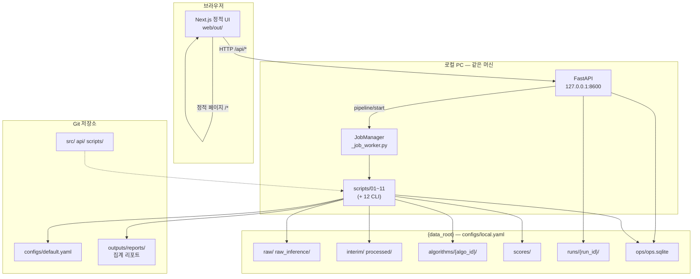
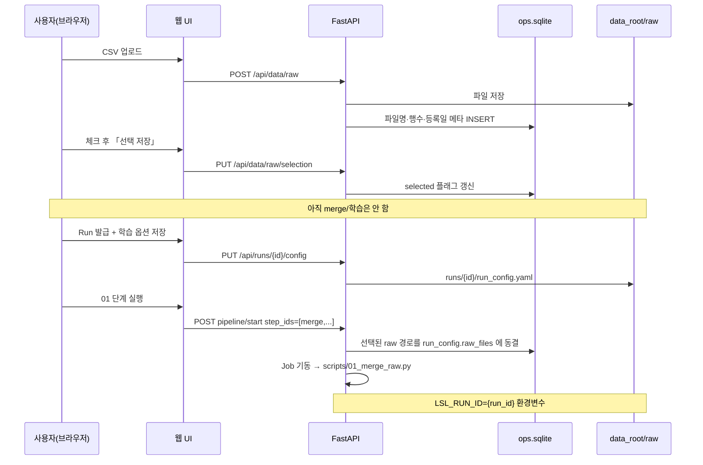
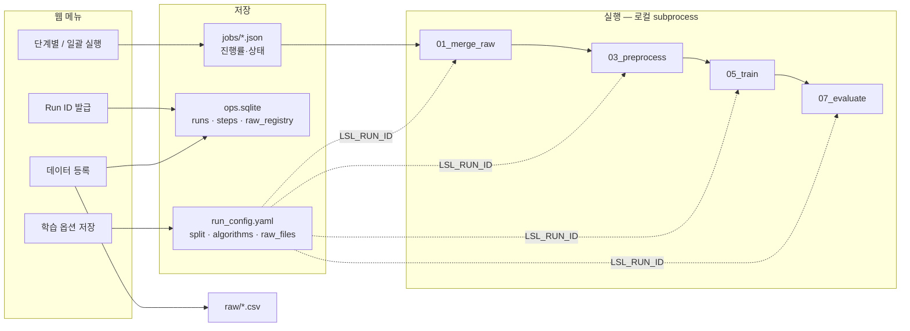

# 로컬 환경 · 웹 UI · 데이터 흐름 (도식)

개발·테스트 시 **브라우저(웹)** 와 **로컬 PC(파일·스크립트)** 가 어디서 무엇을 하는지 한눈에 보기 위한 문서입니다.

관련: [`web_local.md`](web_local.md) · [`pipeline.md`](pipeline.md) · [`user_guide.md`](user_guide.md)

---

## 1. 한 줄 요약

| 구분 | 역할 |
|------|------|
| **웹(브라우저)** | 버튼·표시만. 실제 연산·CSV·모델 파일은 다루지 않음 |
| **FastAPI (`127.0.0.1:8600`)** | 웹 요청을 받아 **메타 DB·Run 설정·Job 기동** |
| **Python 스크립트 (`scripts/01~12`)** | `{data_root}` 의 파일을 읽고 쓰며 **학습·평가·추론** 수행 |
| **`{data_root}`** | raw·모델·점수 등 **민감·대용량 데이터** (Git에 없음) |
| **Git 저장소** | 코드·`configs/default.yaml`·집계 리포트(`outputs/reports`) |

웹에서 「학습 실행」을 눌러도, 내부적으로는 **같은 PC에서 `python scripts/…` 가 백그라운드로 실행**됩니다.

---

## 2. 전체 구조



**실행 진입점**

- **웹:** `RunWebNext.bat` → 브라우저 `http://127.0.0.1:8600`
- **CLI:** 터미널에서 `python scripts/05_train.py …` (동일 `data_root`·동일 스크립트)

---

## 3. 저장 위치 — 무엇이 어디에 있나

```text
[Git 저장소]                          [{data_root} — 로컬 전용]
LocalSubsidies_SupervisedLearning/    (configs/local.yaml 의 data_root)
├── api/          ← FastAPI            ├── raw/              ← 학습 CSV (등록 풀)
├── web/out/      ← 브라우저 UI        ├── raw_inference/    ← 추론 CSV
├── scripts/      ← 파이프라인         ├── interim/          ← 01~02 중간 (공용)
├── configs/                           ├── processed/        ← 03 전처리 (공용)
│   ├── default.yaml                   ├── algorithms/       ← 05~ 모델·리포트 (공용)
│   └── local.yaml  ──data_root──►     │   ├── random_forest_v2/
└── outputs/reports/  ← 집계 Excel/PDF  │   └── operations/
                                       ├── scores/           ← 07·11 점수 (공용)
                                       ├── runs/{run_id}/    ← Run별 설정·로그·Job
                                       │   ├── run_config.yaml
                                       │   └── jobs/
                                       └── ops/ops.sqlite      ← Run·단계·raw 메타
```

### 헷갈리기 쉬운 점

| 항목 | Run마다 따로? | 설명 |
|------|---------------|------|
| `run_config.yaml` (split, algorithms, raw_files) | **Run별** | `{data_root}/runs/{run_id}/` |
| `ops.sqlite` (Run 발급, 단계 상태, raw **메타**) | Run·파일 **메타** | CSV **내용**은 DB에 없음 |
| `raw/` 실제 CSV 파일 | **공용 풀** | 여러 Run이 같은 풀 공유 |
| `interim/` · `processed/` · `algorithms/` | **공용 (마지막 실행이 덮어씀)** | Run A 후 Run B 실행 시 B 결과로 교체 |
| `outputs/reports/` (repo) | 집계 리포트 | 웹·CLI 공통 참조 |

→ **「Run을 바꿨는데 모델 폴더가 안 바뀐다」** 는 정상입니다. 작업 산출은 `data_root` 공용 경로에 **최신 1벌**만 유지됩니다. Run 구분은 **설정·이력·ops DB** 로 봅니다.

---

## 4. 데이터 등록 ~ 학습 시작 (웹 기준)



**로컬에서 일어나는 일 (웹/CLI 동일)**

1. **01** — `run_config.raw_files`(또는 선택 raw)만 읽어 `interim/merged.csv` 생성  
2. **02** — `labeled.csv`  
3. **03** — Train/Test 분할 + `processed/`  
4. **04~10** — 학습·평가·리포트·4×4  

---

## 5. Run · Job · 스크립트 연결



- **Job 배너** = `{data_root}/runs/_active_job.json` 등을 API가 읽어 표시  
- 콘솔 창(`RunWebNext.bat`)을 닫으면 API·Job 모두 중단  

---

## 6. 학습 vs 추론 vs 튜닝 (경로 분리)

```mermaid
flowchart TB
  subgraph train_path [학습·평가 — 웹 「학습 실행」 01~10]
    T0[raw 선택] --> T1[01~04]
    T1 --> T2[05 학습\nalgorithms/{algo_id}/]
    T2 --> T3[06~10]
    T3 --> T4[scores/test/\nops_queue_test]
  end

  subgraph infer_path [추론 — 웹 「추론」 11]
    I0[raw_inference 선택] --> I1[11_score_inference]
    I1 --> I2[scores/inference/\nops_queue_inference]
  end

  subgraph tune_path [튜닝 — CLI 전용 12]
    U1[labeled + processed\n이미 01~03 필요]
    U1 --> U2[12_tune_hyperparams.py]
    U2 --> U3[hyperparam_tune_*.json\nrepo outputs/reports]
    U3 --> U4[v2 등록 후\n다시 05~10]
  end

  T3 -.->|모델 사용| I1
  T1 -.->|전처리 선행| U1
```

| 단계 | 웹 | CLI | 주요 입력 | 주요 출력 |
|------|-----|-----|-----------|-----------|
| 데이터 등록 | ○ | (업로드 API만) | CSV | `raw/` + DB 메타 |
| 01~10 | ○ Job | ○ 직접 실행 | `run_config` | `interim`~`algorithms`, `scores/test` |
| 11 추론 | ○ | ○ | `raw_inference` + 학습된 모델 | `scores/inference` |
| 12 튜닝 | ✗ | ○ | `processed`, Train 마스크 | `outputs/reports/comparison/` |

---

## 7. 웹 화면 ↔ 로컬 파일 매핑

| 웹 메뉴 | API·설정 | 로컬에서 생기는 것 |
|---------|----------|-------------------|
| Run ID 발급 | `POST /api/runs` | `ops.sqlite` runs + `runs/{id}/run_config.yaml` |
| 데이터 등록 | `/api/data/raw*` | `raw/*.csv` + raw_registry (메타) |
| 학습 실행 · 옵션 | `/api/runs/{id}/config` | `run_config.yaml` (split, algorithms) |
| 학습 실행 · 01~10 | `pipeline/start` → Job | `interim/`, `processed/`, `algorithms/`, `scores/test/`, repo `outputs/reports/` |
| 모델 비교·평가 | `/api/models/*` | `algorithms/eval_summary.json`, SQLite 순위 |
| 타겟 포착 분포 | `/api/ops/*` | `algorithms/operations/ops_queue_test.*` |
| 추론 실행 | `/api/inference/*` | `scores/inference/`, `ops_queue_inference.*` |
| 대시보드 | Run 선택 + 위 결과 조회 | (조회만, 새 파일 없음) |
| 설정 | `data_root` 표시 | `configs/local.yaml` |

---

## 8. 지금 하시는 작업 (v2 Test) — 흐름 예시

```text
[완료] Run 발급 · raw 선택 · random split · 01~04
[완료] 12_tune (CLI) → random_forest_v2 / catboost_v2 등록 (repo configs)
[진행] 웹: 옵션에 v1·v2 선택 → 05~10 Job
         │
         ├─ 05: data_root/algorithms/random_forest_v1|v2/, catboost_v1|v2/
         ├─ 07: data_root/scores/test/*_test_scores*
         └─ 08~10: 순위·4×4 → ops.sqlite + operations/
[다음] Test 지표로 v2 채택 · 주·보 갱신 (ops_queue)
```

- **12는 웹에 없음** — 터미널에서만 실행  
- **05~10은 웹 Job = 로컬 스크립트** — 브라우저만으로는 모델 파일이 생기지 않음  

---

## 9. 자주 헷갈리는 질문

**Q. 웹에서 pull만 했는데 화면이 예전이다**  
→ UI는 `web/out/` 정적 파일. `git pull` 후 `RestartWeb.bat` + Ctrl+F5.

**Q. Run을 바꿨는데 알고리즘 폴더가 예전 모델이다**  
→ `algorithms/` 는 Run별이 아니라 **마지막 성공 학습 1벌**. Run 이력은 `ops.sqlite`·`runs/{id}/logs`.

**Q. 데이터 등록했는데 01이 다른 CSV를 쓴다**  
→ 「선택 저장」 후 **01 포함 Job**을 시작해야 `raw_files` 가 Run에 동결됨. 01 없이 03만 CLI로 돌리면 **현재 DB 선택**과 어긋날 수 있음.

**Q. 전체 작업 취소 후 v2만 고르면 01~04를 다시 해야 하나**  
→ **아니요.** 옵션만 풀리고 `processed/` 등은 유지. **05부터** 가능 (분할·데이터 동일 시).

**Q. 학습 옵션에서 RF/CatBoost 4종만 골랐는데 모델 비교에 예전 5종 v1만 보인다**  
→ (v0.3.0 이후 수정) 06~10도 `run_config.algorithms` 를 따릅니다. 코드 반영 후 **같은 Run에서 06~08**(또는 05~10)을 **다시 실행**하세요. 05만 4종을 학습하고 07~08이 `default.yaml` 5종을 평가·순위에 쓰던 문제였습니다.

**Q. Agent가 스크립트를 대신 실행해 주나**  
→ **아니요.** 민감데이터 격리 규칙상 로컬 터미널·웹 Job만 사용.

### 학습 옵션 · 데이터 — 쉬운 정리

웹 **학습 옵션**은 split(Train/Test 나누는 방식)과 algorithms(어떤 모델을 학습·평가할지)를 **한 번에 「학습 옵션 저장」** 합니다. 둘을 따로 저장하지 않습니다.

Job이 **한 번이라도 돌기 시작하면** 옵션 화면은 **잠깁니다**. 바꾸려면 **「전체 작업 취소 후 설정 수정」** → 다시 저장 → 원하는 단계부터 Job을 시작합니다.

#### 세 층만 기억하기

학습 결과는 아래처럼 **아래에서 위로** 쌓입니다.

```text
[3층] algorithms — 05~10 (어떤 모델을 학습·평가할지)
[2층] split      — 03     (Train/Test 어떻게 나눌지)
[1층] CSV        — 01     (어떤 raw 파일을 합칠지)
```

**어느 번호부터 Job을 다시 시작하느냐**에 따라, 그 층 **위쪽만** 새 설정으로 갈아끼울 수 있습니다.

#### 경우 1 — Job이 도는 중 (취소하지 않음)

예: 옵션 A(r random + RF/CB v1)로 01~10을 돌리는데, 05 학습 중에 화면에서 옵션 B(time + v2)로 바꾸거나 저장하려 함.

**어떻게 되나:** 저장 버튼이 **막혀 있거나**, 저장해도 **지금 돌아가는 Job에는 적용되지 않습니다**. 이미 시작된 Job은 **Job을 시작할 때 저장해 둔 옵션 A**로 끝까지 갑니다. 데이터 등록에서 CSV를 바꿔도 **Job 중에는 동일**합니다.

#### 경우 2 — 취소 → 옵션 B 저장 → **05~10만** 실행 (v2만 바꿀 때)

예: 옵션 A로 01~04까지 끝난 뒤 05에서 취소. 옵션 B(모델만 v2 두 종) 저장. 05부터 10까지만 다시 Job.

**어떻게 되나:**

- **CSV(1층):** 첫 번째 Job 때 01이 만든 통합·라벨 데이터 **그대로**
- **split(2층):** 첫 번째 Job 때 03이 만든 Train/Test 나눔 **그대로**
- **algorithms(3층):** **옵션 B** — 05가 v2를 새로 학습하고, 06~10도 **저장된 모델 목록**으로 평가·순위·4×4

같은 데이터·같은 분할 위에서 **모델(버전)만 바꿔 다시 돌리는** 패턴입니다. **01~04를 다시 할 필요 없습니다.**

#### 경우 3 — 취소 → 옵션 B 저장 → **03~10** 실행 (split만 바꿀 때)

예: random 30% → 기간(time) 분할로 바꾼 **옵션 B** 저장. 03 전처리부터 Job (01·02는 생략해도 됨).

**어떻게 되나:**

- **CSV(1층):** **그대로** (01을 다시 실행하지 않았으므로)
- **split(2층):** **옵션 B** — 03이 새 split으로 `processed/`·Train/Test 마스크를 **다시 만듦**
- **algorithms(3층):** **옵션 B** — 05~10은 **새 split** 위에서 학습·평가

분할 방식을 바꾸려면 **03을 꼭 다시** 돌려야 합니다. 05~10만으로는 split이 바뀌지 **않습니다**.

#### 경우 4 — 취소 → (CSV도 변경) 옵션 B 저장 → **01~10** 처음부터

예: 데이터 등록에서 CSV 6개만 선택 저장 → 옵션 B 저장 → 01~10 일괄 Job.

**어떻게 되나:** **1·2·3층 모두** 이번에 저장·선택한 내용으로 처음부터 다시 쌓입니다. 01 시작 시 **선택 CSV가 Run에 동결**되고, 03에서 **옵션 B split**, 05~10에서 **옵션 B 모델 목록**이 적용됩니다.

#### 경우 5 — 01~10을 **이미 한 번 끝낸 뒤**, 옵션 B로 다시

- **05~10만** → **경우 2**와 같음 (CSV·split 유지, 모델만 B)
- **03~10** → **경우 3**과 같음 (CSV 유지, split·모델 B)
- **01~10** → **경우 4**와 같음 (CSV까지 바꿨으면 1층도 변경)

#### 표로 한 번 더 (Job 시작 단계만 보면 됨)

| 이번 Job을 어디서 시작? | CSV | split | algorithms |
|------------------------|-----|-------|------------|
| **05~10** | 이전 그대로 | 이전 그대로 | **방금 저장한 옵션** |
| **03~10** | 이전 그대로 | **방금 저장한 옵션** | **방금 저장한 옵션** |
| **01~10** | **(01 시) 방금 선택 저장한 CSV** | **방금 저장한 옵션** | **방금 저장한 옵션** |

**실무 팁:** 모델 목록(algorithms)을 바꿨으면 **05부터** 실행하세요. 07(평가)만 돌리면, 새로 고른 모델 중 **아직 05에서 학습하지 않은 것**은 model 파일이 없어 **오류나 누락**이 날 수 있습니다.

**Q. 취소 후 v2만 고르면 01~04를 다시 해야 하나**  
→ **아니요.** **05부터**면 됩니다. split까지 바꿨으면 **03부터**, CSV까지 바꿨으면 **01부터**.

---

## 10. 관련 문서

- [`web_local.md`](web_local.md) — 실행·아키텍처  
- [`pipeline.md`](pipeline.md) — 스크립트 번호·산출물  
- [`user_guide.md`](user_guide.md) — 사용자 조작 순서  
- [`model_tuning.md`](model_tuning.md) · [`hyperparam_methodology.md`](hyperparam_methodology.md) — 12 튜닝·v2  
- [`AGENT_BOUNDARY.md`](AGENT_BOUNDARY.md) — Agent가 건드리지 않는 범위  
